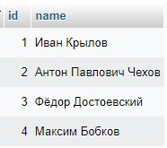
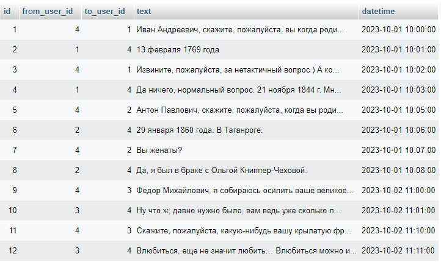
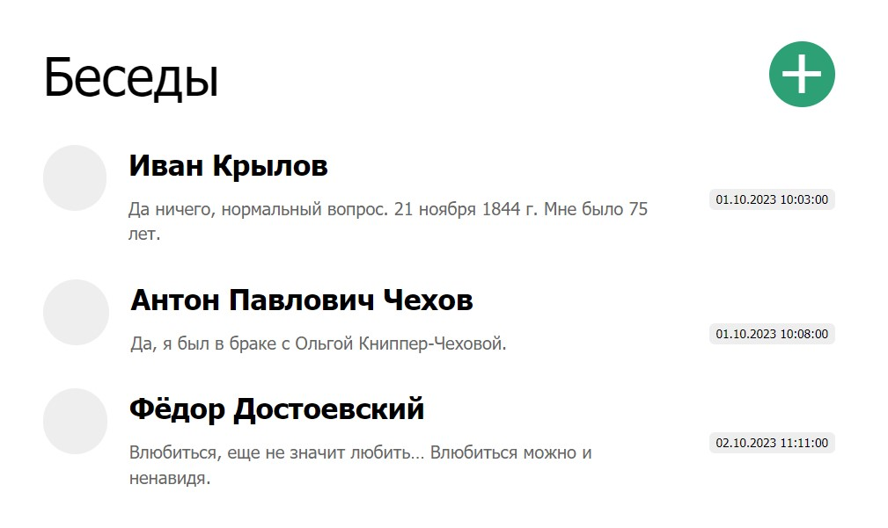
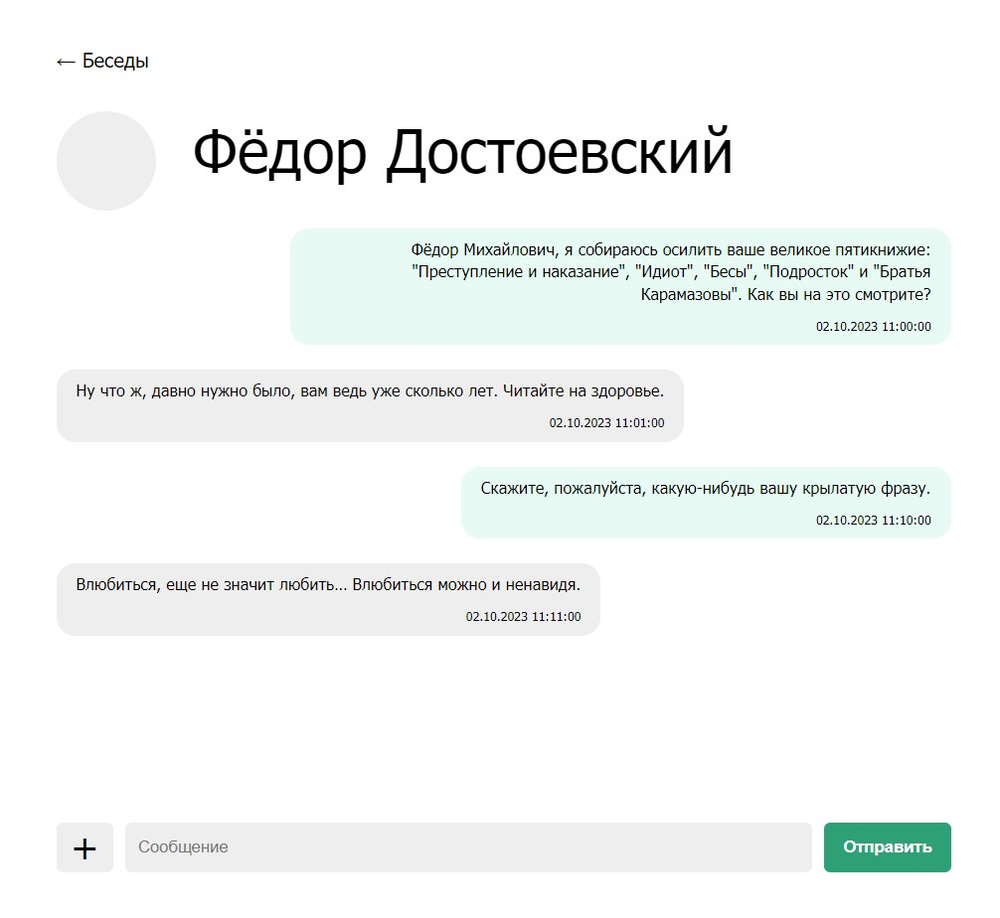

# Домашнее задание по уроку 11 "Сервис-ориентированные архитектуры".

Реализовал [**проект**](https://github.com/biramax/Architecture/tree/main/Seminar-11/messenger) в веб-интерфейсе на PHP, т.к. знаком с этим языком, а изучать веб/десктоп/мобайл-реализацию на других языках, к сожалению, не хватает времени.

Используется три основных класса по паттерну MVP: Viewer, Presenter и Model.

Viewer привязал к программе через интерфейс и предусмотрел возможность в случае необходимости замены Вьюера на другой (мобильный, например).

Создал класс User для создания объектов в виде любого пользователя, а владельца аккаунта наследовал от User в класс AccountOwner.

Ввиду нехватки времени не стал реализовывать регистрацию и авторизацию пользователей, добавление ими сообщений в базу данных. Заранее заготовил в базе данных таблицу с юзерами и таблицу с их сообщениями.

---

Реализовал два экрана: 

### Страница со всеми чатами

### Конкретный чат

---

Записал краткий видео-ролик с демонстрацией реализованного проекта:

---

PHP-файлы проекта находятся в папке [**messenger**](https://github.com/biramax/Architecture/tree/main/Seminar-11/messenger). Там же находится дамп базы данных mysql.

Скриншоты реализованного проекта находятся в папке [**screenshots**](https://github.com/biramax/Architecture/tree/main/Seminar-11/screenshots).
