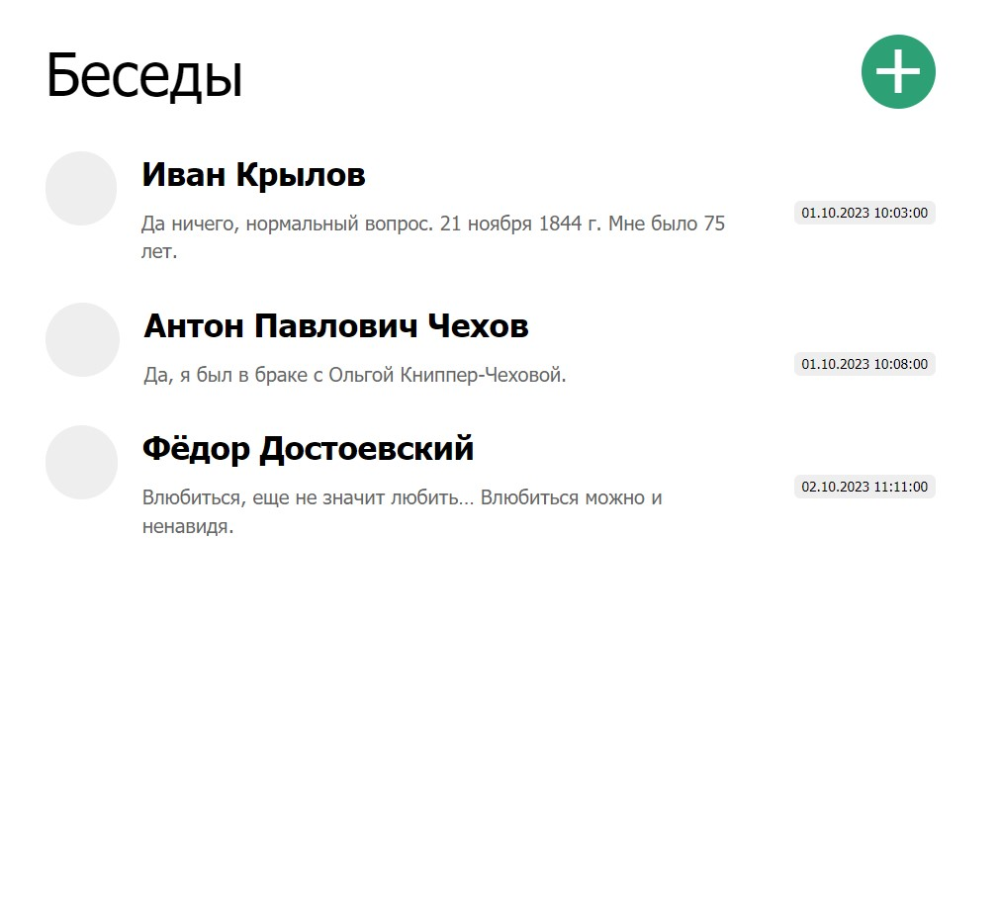
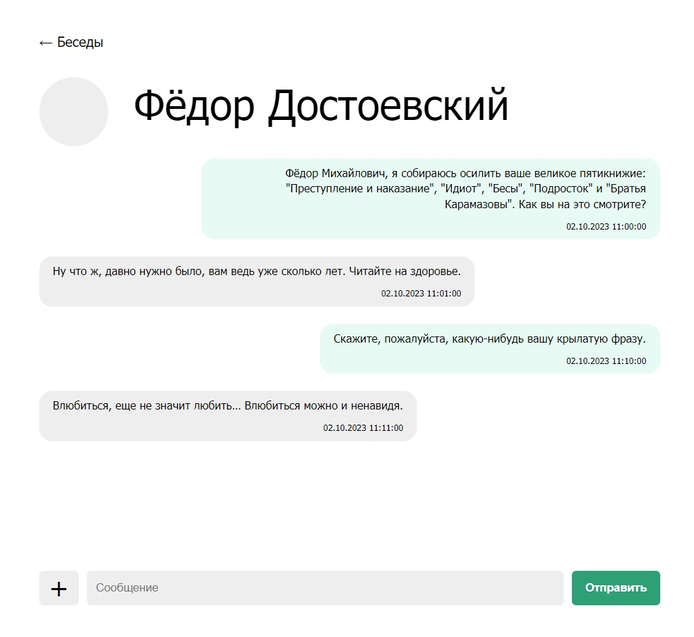
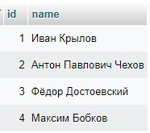
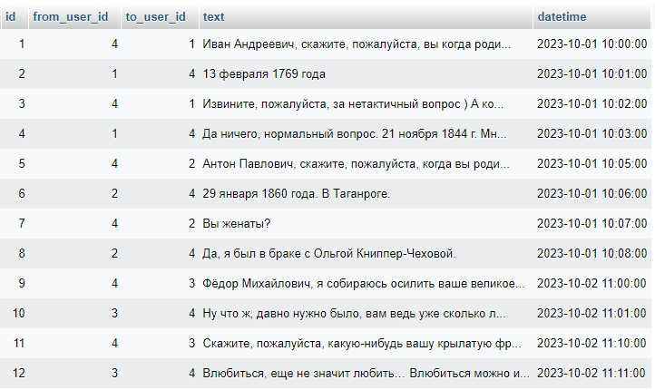

## Домашнее задание по уроку 11 "Сервис-ориентированные архитектуры".

Создал проект в веб-интерфейсе на PHP, т.к. немного знаком с этим языком. 

Реализовал два экрана: 1) страницу со всеми чатами; 2) конкретный чат.

Ввиду нехватки времени не стал реализовывать регистрацию и авторизацию пользователей, добавление ими сообщений в базу данных. Заранее заготовил в базе данных таблицу с юзерами и таблицу с их сообщениями.

Создал и связал три основных класса по паттерну MVP: Viewer, Presenter и Model.

Viewer привязал к программе через интерфейс и предусмотрел возможность замены Вьюера на другой.

Создал класс User для создания объектов в виде любого пользователя, а владельца аккаунта наследовал от User в класс AccountOwner.

Сделал краткий [видео-ролик](Демонстрация-реализованного-проекта.mp4) с демонстрацией реализованного проекта.