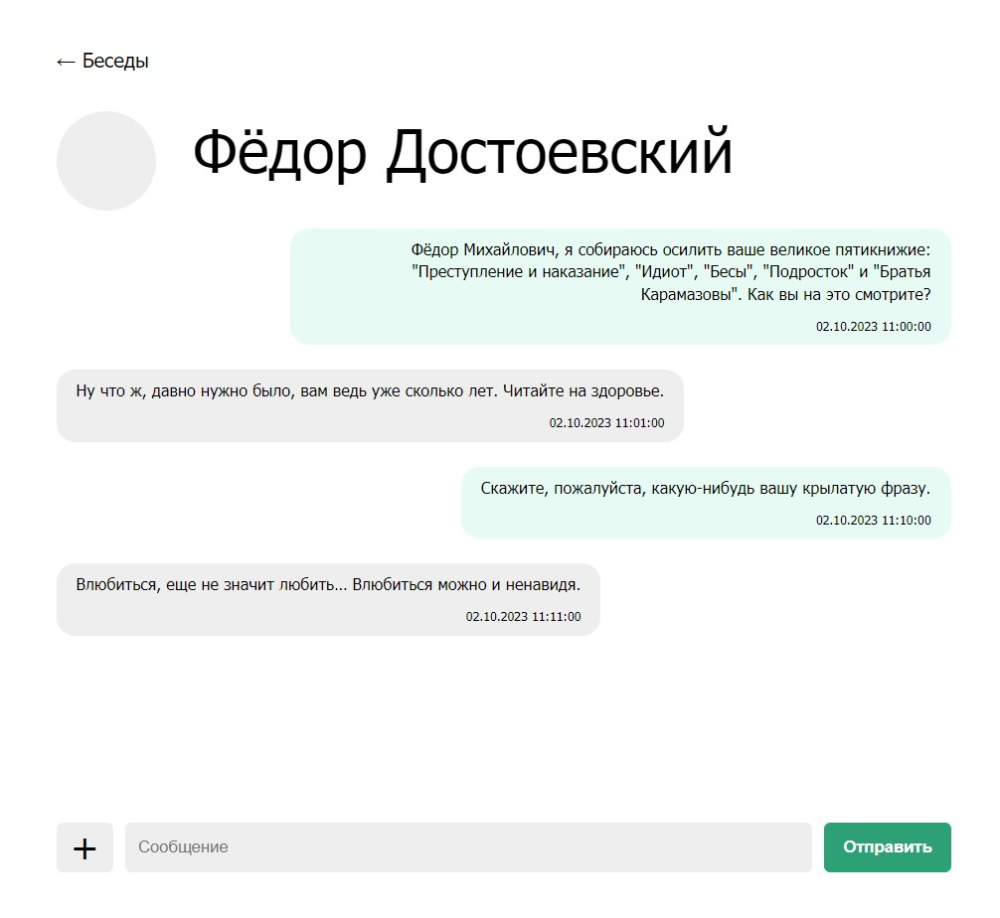

# Домашнее задание по уроку 11 "Сервис-ориентированные архитектуры".

## 1. Проектирование программы "Мессенджер". Use-case, UML и ERD диаграммы

Программа спроектирована по паттерну MVP.

### Use case диаграмма

### UML-диаграмма

### ERD-диаграмма

## 2. Разработка дизайн-макетов мессенджера

При помощи онлайн-сервиса https://www.figma.com были разработаны дизайн-макеты двух экранов программы: 

### Страница со всеми чатами

### Конкретный чат

## 3. Реализация мессенджера в веб-формате

Спроектированные два экрана программы разработаны на базе веб-интерфейса на языке PHP.

PHP-файлы проекта находятся в папке [**messenger**](https://github.com/biramax/Architecture/tree/main/Seminar-12/messenger). Там же находится [**дамп**](https://github.com/biramax/Architecture/tree/main/Seminar-12/messenger/Дамп-базы-данных.sql) базы данных mysql.

Скриншоты реализованного проекта:

### Страница со всеми чатами

### Конкретный чат

### Краткий видео-ролик с демонстрацией реализованного проекта:

## 4. Тестирование

В процессе UAT-тестирования программы были выявлены следующие недоработки программы: 
1. Программа не проверяет валидность полученного через GET-переменные идентификатора чата (id респондента)
2. Используется слишком тяжёлый запрос к базе данных при выборке последних сообщений по каждому чату, нужно пересмотреть организацию базы данных на предмет возможности оптимизации запросов к ней.
3. Не предусмотрено поведение программы при неудачном запросе к БД.
4. Не предусмотрено поведение программы, если респондент удалён, а его сообщения остаются в БД.
5. Не работает кнопка "+" на странице чатов - создание новой беседы.
6. Не работает кнопка "+" на странице конкретной беседы - добавление медиа-файла.
7. Программа не отправляет сообщения )